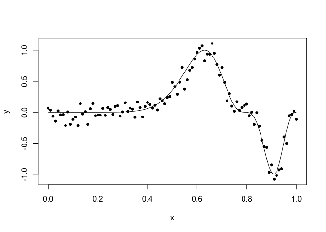

## Q1a

```r
# Generate data
set.seed(567)
funky <- function(x) sin(2*pi*x^3)^3 
x <- seq(0,1,by=0.01)
y <- funky(x) + 0.1*rnorm(101)
g <- glm(y~bs(x,12))
summary(g)
```

```
## 
## Call:
## glm(formula = y ~ bs(x, 12))
## 
## Deviance Residuals: 
##      Min        1Q    Median        3Q       Max  
## -0.29228  -0.08311   0.00759   0.08487   0.34679  
## 
## Coefficients:
##              Estimate Std. Error t value Pr(>|t|)    
## (Intercept)  0.054064   0.117818   0.459  0.64745    
## bs(x, 12)1  -0.152381   0.228161  -0.668  0.50597    
## bs(x, 12)2  -0.187115   0.160931  -1.163  0.24809    
## bs(x, 12)3   0.009449   0.175865   0.054  0.95727    
## bs(x, 12)4  -0.075038   0.152144  -0.493  0.62310    
## bs(x, 12)5   0.102117   0.160517   0.636  0.52631    
## bs(x, 12)6  -0.028392   0.154971  -0.183  0.85506    
## bs(x, 12)7   1.268988   0.158122   8.025 4.11e-12 ***
## bs(x, 12)8   0.356415   0.158116   2.254  0.02667 *  
## bs(x, 12)9   0.174132   0.164564   1.058  0.29289    
## bs(x, 12)10 -1.232701   0.185962  -6.629 2.62e-09 ***
## bs(x, 12)11 -0.608234   0.189397  -3.211  0.00185 ** 
## bs(x, 12)12  0.097349   0.166581   0.584  0.56045    
## ---
## Signif. codes:  0 '***' 0.001 '**' 0.01 '*' 0.05 '.' 0.1 ' ' 1
## 
## (Dispersion parameter for gaussian family taken to be 0.02134686)
## 
##     Null deviance: 19.6521  on 100  degrees of freedom
## Residual deviance:  1.8785  on  88  degrees of freedom
## AIC: -87.822
## 
## Number of Fisher Scoring iterations: 2
```

```r
# Data points and true model
matplot(x,cbind(y,funky(x)),type="pl",ylab="y",pch=20, lty=1, col=1)
```

<!-- -->

```r
# Data points and spline model
matplot(x,cbind(y,g$fit), type="pll", ylab="y",lty=c(1,2),
pch=20, col=1)
```

<!-- -->

## Q1b

```r
# Calculation of AIC using function
AIC(g)
```

```
## [1] -87.82249
```

```r
# Calculation of AIC by hand (number of parameters = 1 intercept + # of x-coefficients + 1 variance)
AIC_hand <- 101*(log(2*pi) + 1 + log(sum((g$residuals)**2)/101)) + 2*14
AIC_hand
```

```
## [1] -87.82249
```

## Q1c

```r
set.seed(567)
knots <- c(3:30)
aic <- NULL
g <- list()
funky <- function(x) sin(2*pi*x^3)^3 
x <- seq(0,1,by=0.01)
y <- funky(x) + 0.1*rnorm(101)

for (i in 1:length(knots)){
  g[[i]] <- glm(y~bs(x,knots[i]))
  aic[i] <- AIC(g[[i]])
}

# Plot of AIC versus knows
plot(knots, aic)
```

<!-- -->

```r
# Best Model
best <- g[[which(aic == min(aic))]]
best
```

```
## 
## Call:  glm(formula = y ~ bs(x, knots[i]))
## 
## Coefficients:
##       (Intercept)   bs(x, knots[i])1   bs(x, knots[i])2  
##          0.049465          -0.073542          -0.219593  
##  bs(x, knots[i])3   bs(x, knots[i])4   bs(x, knots[i])5  
##         -0.069897          -0.056700          -0.003919  
##  bs(x, knots[i])6   bs(x, knots[i])7   bs(x, knots[i])8  
##         -0.007309           0.002959           0.130810  
##  bs(x, knots[i])9  bs(x, knots[i])10  bs(x, knots[i])11  
##          0.393921           0.850677           1.148139  
## bs(x, knots[i])12  bs(x, knots[i])13  bs(x, knots[i])14  
##         -0.122461           0.151681          -0.393581  
## bs(x, knots[i])15  bs(x, knots[i])16  bs(x, knots[i])17  
##         -1.732244           0.394425          -0.177359  
## 
## Degrees of Freedom: 100 Total (i.e. Null);  83 Residual
## Null Deviance:	    19.65 
## Residual Deviance: 0.8108 	AIC: -162.7
```

## Q1d

```r
matplot(x,cbind(y,best$fit), type="pll", ylab="y",lty=c(1,2),
pch=20, col=1)
```

<!-- -->

## Q2a

```r
library(faraway)
odor_lm <- lm(odor ~ temp + gas + pack 
           + I(temp^2) + I(gas^2) + I(pack^2) 
           + temp:gas + temp:pack + gas:pack, data = odor)
summary(odor_lm)
```

```
## 
## Call:
## lm(formula = odor ~ temp + gas + pack + I(temp^2) + I(gas^2) + 
##     I(pack^2) + temp:gas + temp:pack + gas:pack, data = odor)
## 
## Residuals:
##        1        2        3        4        5        6        7        8 
## -20.6250  -6.8750   6.8750  20.6250  15.5000   1.7500  -1.7500 -15.5000 
##        9       10       11       12       13       14       15 
##   5.1250 -22.3750  22.3750  -5.1250  -0.3333  -4.3333   4.6667 
## 
## Coefficients:
##             Estimate Std. Error t value Pr(>|t|)   
## (Intercept)  -30.667     12.978  -2.363  0.06451 . 
## temp         -12.125      7.947  -1.526  0.18761   
## gas          -17.000      7.947  -2.139  0.08542 . 
## pack         -21.375      7.947  -2.690  0.04332 * 
## I(temp^2)     32.083     11.698   2.743  0.04067 * 
## I(gas^2)      47.833     11.698   4.089  0.00946 **
## I(pack^2)      6.083     11.698   0.520  0.62524   
## temp:gas       8.250     11.239   0.734  0.49588   
## temp:pack      1.500     11.239   0.133  0.89903   
## gas:pack      -1.750     11.239  -0.156  0.88236   
## ---
## Signif. codes:  0 '***' 0.001 '**' 0.01 '*' 0.05 '.' 0.1 ' ' 1
## 
## Residual standard error: 22.48 on 5 degrees of freedom
## Multiple R-squared:  0.882,	Adjusted R-squared:  0.6696 
## F-statistic: 4.152 on 9 and 5 DF,  p-value: 0.06569
```

## Q2b
Use the backward elimination method with a cut-off of 5% to select a smaller model.

```r
odor_lm <- update(odor_lm, . ~ . - temp:pack)
summary(odor_lm)
```

```
## 
## Call:
## lm(formula = odor ~ temp + gas + pack + I(temp^2) + I(gas^2) + 
##     I(pack^2) + temp:gas + gas:pack, data = odor)
## 
## Residuals:
##      Min       1Q   Median       3Q      Max 
## -22.3750  -6.0000  -0.3333   6.0000  22.3750 
## 
## Coefficients:
##             Estimate Std. Error t value Pr(>|t|)   
## (Intercept)  -30.667     11.868  -2.584  0.04155 * 
## temp         -12.125      7.268  -1.668  0.14630   
## gas          -17.000      7.268  -2.339  0.05792 . 
## pack         -21.375      7.268  -2.941  0.02591 * 
## I(temp^2)     32.083     10.698   2.999  0.02404 * 
## I(gas^2)      47.833     10.698   4.471  0.00423 **
## I(pack^2)      6.083     10.698   0.569  0.59023   
## temp:gas       8.250     10.278   0.803  0.45278   
## gas:pack      -1.750     10.278  -0.170  0.87040   
## ---
## Signif. codes:  0 '***' 0.001 '**' 0.01 '*' 0.05 '.' 0.1 ' ' 1
## 
## Residual standard error: 20.56 on 6 degrees of freedom
## Multiple R-squared:  0.8816,	Adjusted R-squared:  0.7237 
## F-statistic: 5.583 on 8 and 6 DF,  p-value: 0.02518
```

```r
odor_lm <- update(odor_lm, . ~ . - gas:pack)
summary(odor_lm)
```

```
## 
## Call:
## lm(formula = odor ~ temp + gas + pack + I(temp^2) + I(gas^2) + 
##     I(pack^2) + temp:gas, data = odor)
## 
## Residuals:
##      Min       1Q   Median       3Q      Max 
## -20.6250  -6.8750  -0.3333   5.7708  24.1250 
## 
## Coefficients:
##             Estimate Std. Error t value Pr(>|t|)   
## (Intercept)  -30.667     11.014  -2.784  0.02713 * 
## temp         -12.125      6.745  -1.798  0.11528   
## gas          -17.000      6.745  -2.520  0.03979 * 
## pack         -21.375      6.745  -3.169  0.01573 * 
## I(temp^2)     32.083      9.928   3.232  0.01442 * 
## I(gas^2)      47.833      9.928   4.818  0.00193 **
## I(pack^2)      6.083      9.928   0.613  0.55943   
## temp:gas       8.250      9.539   0.865  0.41575   
## ---
## Signif. codes:  0 '***' 0.001 '**' 0.01 '*' 0.05 '.' 0.1 ' ' 1
## 
## Residual standard error: 19.08 on 7 degrees of freedom
## Multiple R-squared:  0.881,	Adjusted R-squared:  0.762 
## F-statistic: 7.403 on 7 and 7 DF,  p-value: 0.008503
```

```r
odor_lm <- update(odor_lm, . ~ . - I(pack^2))
summary(odor_lm)
```

```
## 
## Call:
## lm(formula = odor ~ temp + gas + pack + I(temp^2) + I(gas^2) + 
##     temp:gas, data = odor)
## 
## Residuals:
##      Min       1Q   Median       3Q      Max 
## -23.4327  -8.8798  -0.4423   5.1250  26.9327 
## 
## Coefficients:
##             Estimate Std. Error t value Pr(>|t|)   
## (Intercept)  -26.923      8.800  -3.060  0.01559 * 
## temp         -12.125      6.476  -1.872  0.09807 . 
## gas          -17.000      6.476  -2.625  0.03042 * 
## pack         -21.375      6.476  -3.301  0.01085 * 
## I(temp^2)     31.615      9.505   3.326  0.01044 * 
## I(gas^2)      47.365      9.505   4.983  0.00107 **
## temp:gas       8.250      9.159   0.901  0.39402   
## ---
## Signif. codes:  0 '***' 0.001 '**' 0.01 '*' 0.05 '.' 0.1 ' ' 1
## 
## Residual standard error: 18.32 on 8 degrees of freedom
## Multiple R-squared:  0.8746,	Adjusted R-squared:  0.7806 
## F-statistic: 9.301 on 6 and 8 DF,  p-value: 0.003003
```

```r
odor_lm <- update(odor_lm, . ~ . - temp:gas)
summary(odor_lm)
```

```
## 
## Call:
## lm(formula = odor ~ temp + gas + pack + I(temp^2) + I(gas^2), 
##     data = odor)
## 
## Residuals:
##     Min      1Q  Median      3Q     Max 
## -17.933  -9.635  -4.067   4.620  26.933 
## 
## Coefficients:
##             Estimate Std. Error t value Pr(>|t|)    
## (Intercept)  -26.923      8.707  -3.092 0.012884 *  
## temp         -12.125      6.408  -1.892 0.091024 .  
## gas          -17.000      6.408  -2.653 0.026350 *  
## pack         -21.375      6.408  -3.336 0.008720 ** 
## I(temp^2)     31.615      9.404   3.362 0.008366 ** 
## I(gas^2)      47.365      9.404   5.036 0.000703 ***
## ---
## Signif. codes:  0 '***' 0.001 '**' 0.01 '*' 0.05 '.' 0.1 ' ' 1
## 
## Residual standard error: 18.12 on 9 degrees of freedom
## Multiple R-squared:  0.8619,	Adjusted R-squared:  0.7852 
## F-statistic: 11.23 on 5 and 9 DF,  p-value: 0.001169
```

```r
# At this point, the largest P-value larger than 0.05 comes from temp.
# Theoretically, I can take temp away so that all parameters are significant.
# However, that means also taking away gas^2, which is the most significant. 
# We can't remove lower order term in presence of higher order terms.
```

## Q2c
Use the step method to select a model using AIC. Using this selected model determine the optimal values of the predictors to minimize odor.

```r
odor_b <- regsubsets(odor ~ temp + gas + pack 
          + I(temp^2) + I(gas^2) + I(pack^2)
          + temp:gas + temp:pack + gas:pack, data = odor)

odor_rs <- summary(odor_b)
odor_rs$which
```

```
##   (Intercept)  temp   gas  pack I(temp^2) I(gas^2) I(pack^2) temp:gas
## 1        TRUE FALSE FALSE FALSE     FALSE     TRUE     FALSE    FALSE
## 2        TRUE FALSE FALSE FALSE      TRUE     TRUE     FALSE    FALSE
## 3        TRUE FALSE FALSE  TRUE      TRUE     TRUE     FALSE    FALSE
## 4        TRUE FALSE  TRUE  TRUE      TRUE     TRUE     FALSE    FALSE
## 5        TRUE  TRUE  TRUE  TRUE      TRUE     TRUE     FALSE    FALSE
## 6        TRUE  TRUE  TRUE  TRUE      TRUE     TRUE     FALSE     TRUE
## 7        TRUE  TRUE  TRUE  TRUE      TRUE     TRUE      TRUE     TRUE
## 8        TRUE  TRUE  TRUE  TRUE      TRUE     TRUE      TRUE     TRUE
##   temp:pack gas:pack
## 1     FALSE    FALSE
## 2     FALSE    FALSE
## 3     FALSE    FALSE
## 4     FALSE    FALSE
## 5     FALSE    FALSE
## 6     FALSE    FALSE
## 7     FALSE    FALSE
## 8     FALSE     TRUE
```

```r
AIC <- 15*(log(2*pi)+1+log(odor_rs$rss/15)) + 2*((1+1+1):(nrow(odor_rs$which)+1+1))

which(AIC == min(AIC))
```

```
## [1] 5
```

```r
odor_best <- lm(odor ~ temp + gas + pack + I(temp^2) + I(gas^2), data = odor)
summary(odor_best)
```

```
## 
## Call:
## lm(formula = odor ~ temp + gas + pack + I(temp^2) + I(gas^2), 
##     data = odor)
## 
## Residuals:
##     Min      1Q  Median      3Q     Max 
## -17.933  -9.635  -4.067   4.620  26.933 
## 
## Coefficients:
##             Estimate Std. Error t value Pr(>|t|)    
## (Intercept)  -26.923      8.707  -3.092 0.012884 *  
## temp         -12.125      6.408  -1.892 0.091024 .  
## gas          -17.000      6.408  -2.653 0.026350 *  
## pack         -21.375      6.408  -3.336 0.008720 ** 
## I(temp^2)     31.615      9.404   3.362 0.008366 ** 
## I(gas^2)      47.365      9.404   5.036 0.000703 ***
## ---
## Signif. codes:  0 '***' 0.001 '**' 0.01 '*' 0.05 '.' 0.1 ' ' 1
## 
## Residual standard error: 18.12 on 9 degrees of freedom
## Multiple R-squared:  0.8619,	Adjusted R-squared:  0.7852 
## F-statistic: 11.23 on 5 and 9 DF,  p-value: 0.001169
```

```r
odor$pred <- predict(odor_best)
min_predictors <- odor[odor$pred == min(odor$pred),]
min_predictors
```

```
##   odor temp gas pack      pred
## 8  -40    1   0    1 -28.80769
```
## Q3

```r
library(MASS)

# Standardize data
seatpos_s <- as.data.frame(apply(seatpos, 2, function(y) (y - mean(y))/sd(y)))

# Find out best lambda
seatpos_ridge <- lm.ridge(hipcenter ~ ., data = seatpos_s, lambda = seq(0, 100, len=101))
which.min(seatpos_ridge$GCV)
```

```
##  22 
##  23
```

```r
# Finding prediction
m <- apply(seatpos[,-9],2,mean)
s <- apply(seatpos[,-9],2,sd)
test <- c(64.800, 263.700, 181.080,178.560, 91.440, 35.640, 40.950, 38.790)

test_matrix <- matrix((test - m)/s, nrow = 1)

ypred_standard <- cbind(1,test_matrix)%*% coef(seatpos_ridge)[23,]
ypred_standard
```

```
##            [,1]
## [1,] -0.5001182
```

```r
ypred <- ypred_standard * sd(seatpos$hipcenter) + mean(seatpos$hipcenter)
ypred
```

```
##           [,1]
## [1,] -194.7156
```

## Q4a


```r
# Fit model
df <- data.frame(X,Y)
fit <- lm(Y ~ ., data = df)
fit_sum <- summary(fit)
fit_sum
```

```
## 
## Call:
## lm(formula = Y ~ ., data = df)
## 
## Residuals:
##     Min      1Q  Median      3Q     Max 
## -3.1910 -0.6224  0.0310  0.6561  2.0701 
## 
## Coefficients:
##             Estimate Std. Error t value Pr(>|t|)    
## (Intercept) -0.15981    0.10764  -1.485    0.141    
## X1           1.08563    0.10539  10.301   <2e-16 ***
## X2           1.93626    0.11554  16.758   <2e-16 ***
## X3           3.17732    0.10527  30.182   <2e-16 ***
## X4          -0.00719    0.10408  -0.069    0.945    
## X5           0.18131    0.11667   1.554    0.124    
## X6          -0.01387    0.10733  -0.129    0.897    
## X7          -0.04095    0.11521  -0.355    0.723    
## X8           0.13789    0.11288   1.222    0.225    
## X9          -0.11464    0.10532  -1.088    0.279    
## X10         -0.10499    0.10612  -0.989    0.325    
## ---
## Signif. codes:  0 '***' 0.001 '**' 0.01 '*' 0.05 '.' 0.1 ' ' 1
## 
## Residual standard error: 1.026 on 89 degrees of freedom
## Multiple R-squared:  0.9385,	Adjusted R-squared:  0.9316 
## F-statistic: 135.7 on 10 and 89 DF,  p-value: < 2.2e-16
```

```r
# Extract the estimate of variance
var_est <- fit_sum$sigma**2
var_est
```

```
## [1] 1.051665
```

## Q4b

```r
# Fit subsets
b <- regsubsets(Y ~ ., data = df)
rs <- summary(b)
rs$which
```

```
##   (Intercept)    X1    X2   X3    X4    X5    X6    X7    X8    X9   X10
## 1        TRUE FALSE FALSE TRUE FALSE FALSE FALSE FALSE FALSE FALSE FALSE
## 2        TRUE FALSE  TRUE TRUE FALSE FALSE FALSE FALSE FALSE FALSE FALSE
## 3        TRUE  TRUE  TRUE TRUE FALSE FALSE FALSE FALSE FALSE FALSE FALSE
## 4        TRUE  TRUE  TRUE TRUE FALSE FALSE FALSE FALSE  TRUE FALSE FALSE
## 5        TRUE  TRUE  TRUE TRUE FALSE  TRUE FALSE FALSE  TRUE FALSE FALSE
## 6        TRUE  TRUE  TRUE TRUE FALSE  TRUE FALSE FALSE  TRUE  TRUE FALSE
## 7        TRUE  TRUE  TRUE TRUE FALSE  TRUE FALSE FALSE  TRUE  TRUE  TRUE
## 8        TRUE  TRUE  TRUE TRUE FALSE  TRUE FALSE  TRUE  TRUE  TRUE  TRUE
```

```r
# Calculate AIC (# of parameters = p=3 (the x-coefficient, the constant and variance2))
AIC <- n*(log(2*pi)+1+log(rs$rss/n)) + 2*((1+1+1):(nrow(rs$which)+1+1))

# Determine which number of predictors has the min AIC
i_minAIC <- which(AIC == min(AIC))

# Plot AIC vs number of predictors
plot(AIC ~ I(1:nrow(rs$which)), ylab="AIC", xlab="Number of Predictors")
```

<!-- -->

```r
# Refit model with 4 predictors
refit <- lm(Y ~ ., data = df[,rs$which[i_minAIC,-1]])
refit_sum <- summary(refit)
refit_sum
```

```
## 
## Call:
## lm(formula = Y ~ ., data = df[, rs$which[i_minAIC, -1]])
## 
## Residuals:
##     Min      1Q  Median      3Q     Max 
## -3.1935 -0.7063  0.0054  0.7846  2.3116 
## 
## Coefficients:
##             Estimate Std. Error t value Pr(>|t|)    
## (Intercept)  -0.1215     0.1027  -1.183    0.240    
## X1            1.0692     0.1006  10.624   <2e-16 ***
## X2            1.9448     0.1119  17.378   <2e-16 ***
## X3            3.1756     0.1035  30.696   <2e-16 ***
## X5            0.1636     0.1100   1.488    0.140    
## X8            0.1734     0.1082   1.604    0.112    
## ---
## Signif. codes:  0 '***' 0.001 '**' 0.01 '*' 0.05 '.' 0.1 ' ' 1
## 
## Residual standard error: 1.011 on 94 degrees of freedom
## Multiple R-squared:  0.9369,	Adjusted R-squared:  0.9335 
## F-statistic:   279 on 5 and 94 DF,  p-value: < 2.2e-16
```

```r
# Extract the estimate of variance
var_est_AIC <- refit_sum$sigma**2
var_est_AIC
```

```
## [1] 1.021466
```
The AIC estimate of variance is different from the one from full model.

## Q4c

```r
n <- 100
p <- 10

var_est <- NULL
var_est_AIC <- NULL

for(i in 1:500) {

X <- matrix(rnorm(n*p), nrow = n, ncol = p)
rand_error <- rnorm(n)
beta <- c(0,1,2,3)
Xs <- cbind(rep(1,n), X[,c(1:3)])
Y <- Xs %*% beta + rand_error

# Fit model
df <- data.frame(X,Y)
fit <- lm(Y ~ ., data = df)
fit_sum <- summary(fit)

# Extract estimate of true variance
var_est[i] <- fit_sum$sigma**2

# Fit subsets
b <- regsubsets(Y ~ ., data = df)
rs <- summary(b)

# Calculate AIC
AIC <- n*(log(2*pi)+1+log(rs$rss/n)) + 2*((1+1+1):(nrow(rs$which)+1+1))

# Determine which number of predictors has the min AIC
i_minAIC <- which(AIC == min(AIC))

# Refit model with 4 predictors
refit <- lm(Y ~ ., data = df[,rs$which[i_minAIC,-1]])
refit_sum <- summary(refit)

# Extract the estimate of variance from AIC chosen model
var_est_AIC[i] <- refit_sum$sigma**2

}

plot(var_est, var_est_AIC)
abline(a = 0,b = 1)
```

<!-- -->

```r
hist(var_est_AIC/var_est)
```

<!-- -->
The AIC estimate of error variance has a linear relationship with the least square estimate of variance.

## Q4d
There is a systematic under estimation of the error variance from sub model selected by AIC criteria. The difference is not that big, but may impact the linear model as a tool for inferencing (e.g. constructing confidence interval). However, prediction should not be affected much.
