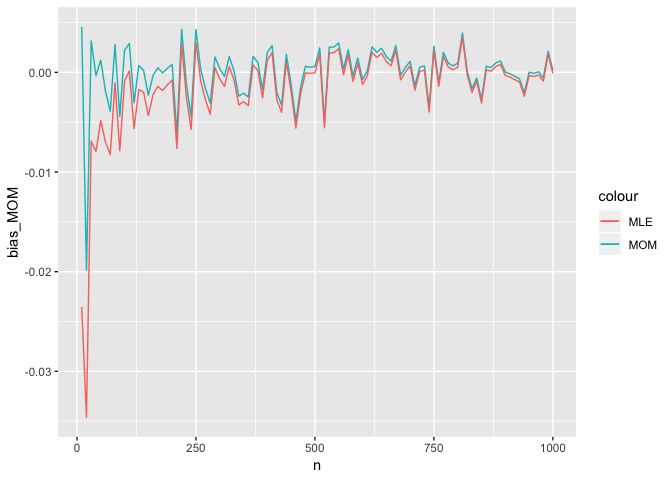

```r
mean_est_MLE <- NULL
mean_est_MOM <- NULL
expected_mean_est_MOM <- NULL
expected_mean_est_MLE <- NULL
bias_MOM <- NULL
bias_MLE <- NULL

n <- seq(10,1000,by = 10)
trials <- 10000

for (j in 1:length(n)) {
  for (i in c(1:10000)) {
  
  # in each trial, assume we want to simulate n random variables (Y) that     has a log normal distribution
  # Y ~ LN(lognorm_mean, lognorm_sd)
  
  # Specify mean of random variable
  lognorm_mean <- 25
  
  # Specify variance of random variable
  lognorm_sd <- 4
  
  # ln(Y) ~ N(norm_mean, norm_sd)
  
  # Calculate 
  norm_mean <- log(lognorm_mean/sqrt(1+lognorm_sd^2/lognorm_mean^2))
  norm_sd <- sqrt(log(1+lognorm_sd^2/lognorm_mean^2))
  
  x <- rlnorm(n[j], norm_mean, norm_sd)
  
  mean_est_MOM[i] <- mean(x)
  mean_est_MLE[i] <- exp(mean(log(x)) + (sd(log(x))*(n[j]-1)/n[j])^2/2)
  
  }
  expected_mean_est_MOM[j] <- mean(mean_est_MOM)
  expected_mean_est_MLE[j] <- mean(mean_est_MLE)
  bias_MOM[j] <- expected_mean_est_MOM[j] - lognorm_mean
  bias_MLE[j] <- expected_mean_est_MLE[j] - lognorm_mean
  mean_est_MOM <- NULL
  mean_est_MLE <- NULL
}

library(ggplot2)
df <- data.frame(n, bias_MOM, bias_MLE)

p <- ggplot(df, aes(x = n)) + geom_line(aes(y=bias_MOM, colour = "MOM")) +geom_line(aes(y = bias_MLE, color = "MLE"))
p
```

<!-- -->
